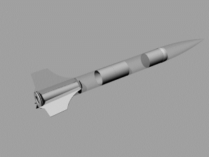

# RhinoORK
Rhino plugin to read OpenRocket (ork) files and create 3D geometry in Rhino 5.

RhinoORK currently can read and generate geometry for:

-Single Stage, non-pod Rocket.
	- Nose Cone, Shapes: Ogive
	- Couplers
	- Bulkheads
	- Centering Rings
	- Motor Mount Tubes
	- Body Tubes
	- Fins, Shapes: Free Form, Elliptical and Trapizodal

	

